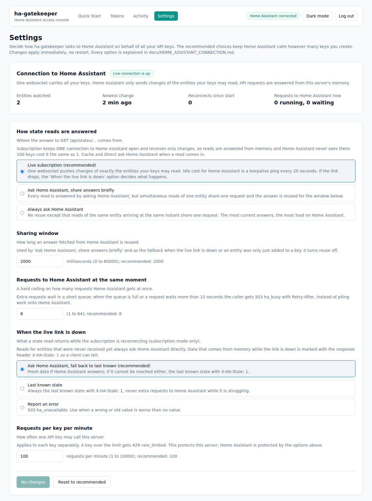

# How ha-gatekeeper talks to Home Assistant

You can create as many scoped API keys as you like. **Home Assistant's load does not grow with the number of keys,
or with how often agents read.** This page explains how, which options you can choose in the dashboard, and what
happens when something goes wrong.



## The short version

```text
 Home Assistant ==(ONE websocket, only changes are pushed)==> memory of this server
 memory of this server ==(an in-process read)==> every API key, every request
```

- ha-gatekeeper opens **one** websocket to Home Assistant and subscribes to exactly the entities your active keys are
  allowed to **read**. Home Assistant then sends a message only when one of those entities changes.
- A state read (`GET /api/states/<entity>`) is answered from memory. Home Assistant never sees it. Ten agents polling
  every second cost Home Assistant the same as none.
- When nothing changes, the only traffic is a keepalive ping every 20 seconds.
- Service calls (`POST /api/services/...`) are real actions, so they always go to Home Assistant; they pass one shared
  gate that limits how many run at the same moment.

## What exactly is watched

The list is rebuilt from your keys: every entity in the **state permissions of active keys**, nothing else.
Disabled keys contribute nothing. Entities that are only used for service calls are not watched.

Creating, editing, disabling or deleting a key (Quick Start, Tokens) reconnects with the new list within about a
second. In that moment, and for an entity that no data has arrived for yet, a read simply asks Home Assistant the
ordinary way, so a read is never answered with data that was not really received.

If more than 2000 entities were readable, the live subscription is not used at all (reads use the ordinary shared path).

## Options you can choose (dashboard > Settings)

Changes apply immediately, no restart. "Reset to recommended" restores all of them.

| Option | Default | What it does |
| --- | --- | --- |
| **How state reads are answered** | Live subscription | *Live subscription*: the websocket above. *Ask Home Assistant, share answers briefly*: every read asks Home Assistant, but simultaneous reads of one entity share one request and the answer is reused for the sharing window. *Always ask Home Assistant*: no reuse except that reads of the same entity arriving at the same instant share one request. |
| **Sharing window** | 2000 ms (0 to 60000) | How long an answer fetched from Home Assistant is reused. Used by the "share answers" mode and by the fallback paths. 0 turns reuse off. |
| **Requests to Home Assistant at the same moment** | 8 (1 to 64) | A hard ceiling. Extra requests wait in a short queue (8 times this number); when the queue is full, or a request waits more than 10 seconds, the caller gets `503 ha_busy` with `Retry-After: 1` instead of piling work onto Home Assistant. |
| **When the live link is down** | Ask Home Assistant, fall back to last known | What a read returns while the websocket is reconnecting. *Ask Home Assistant, fall back to last known*: fresh data if Home Assistant answers; if it cannot be reached either, the last known state marked `X-HA-Stale: 1`. *Last known state*: always the last known state with `X-HA-Stale: 1`, never extra requests while Home Assistant struggles. *Report an error*: `503 ha_unavailable`; use it when an old value is worse than none. |
| **Requests per key per minute** | 100 (1 to 10000) | How often one API key may call this server (`429 rate_limited` above it). Protects this server; Home Assistant is protected by the options above. |

The two starting values can also be set in `.env` (`HA_STATE_CACHE_MS`, `HA_MAX_CONCURRENCY`); a value saved in the
dashboard wins over `.env`. Every saved change is written to the audit log (`admin.settings.update`).

The **Connection to Home Assistant** card at the top of the page shows whether the live link is up, how many
entities are watched, when the newest change arrived, how often it reconnected, and what is running against Home
Assistant right now. The same data is at `GET /admin/connection` (admin session required).

## What clients see

| Situation | Response |
| --- | --- |
| Normal read | `200` with the entity's state, the same fields as Home Assistant's REST API except `context` (`entity_id`, `state`, `attributes`, `last_changed`, `last_updated`). |
| Live link down, answer is the last known state | `200` plus the header **`X-HA-Stale: 1`**. A client that cares can check it. |
| Home Assistant saturated by your own settings | `503 {"ok":false,"error":"ha_busy"}` and `Retry-After: 1`. |
| Link down and the option says "Report an error" | `503 {"ok":false,"error":"ha_unavailable"}` and `Retry-After: 5`. |
| Entity removed from Home Assistant | The state becomes `unavailable` (the entity is never silently dropped). |
| Key not allowed to read the entity | `403`, checked before any lookup, exactly as before. |

After a service call the next reads ask Home Assistant directly for 1.5 seconds, so a client always sees the effect of
its own call even though Home Assistant's change message is still on its way.

## When things go wrong

| What happens | What ha-gatekeeper does |
| --- | --- |
| Home Assistant restarts or the network drops | Reconnects by itself: 5 s, then 10, 20, 40, up to 60 s between attempts; the wait resets once a connection lived for a minute. Reads follow the "When the live link is down" option meanwhile. |
| A silent link (WiFi that dies without closing) | Every 20 s of silence a ping is sent; three silent windows in a row (about a minute) drop the socket and reconnect. Any message at all, not only a pong, proves the link alive. |
| A broken or odd message | Skipped; the connection stays up. |
| Home Assistant rejects the token | Retried with back-off; the card shows "Last problem: Home Assistant rejected the token". |
| The token file changes | Picked up without a restart (the installer recreates the container when a secret changes). |
| The list of watched entities cannot be built (database busy) | The error is logged, the last known data stays, the next attempt retries. |
| The live loop itself crashes | Logged, restarted after 10 s. It never dies silently. |

## Good to know

- **One process.** The live copy lives in this server process. Run one instance (the supplied Docker setup does).
  Several replicas would each open their own websocket and hold their own copy.
- **Same token, same permissions.** The websocket authenticates with the same long-lived token as before (kept in a
  root-only file, not in the container environment). Nothing about what a key may read changes: the permission check
  happens before any state is looked up.
- **In memory only.** States are never written to disk. Only the entities your keys may read are held.
- **Home Assistant add-on mode** uses the Supervisor's websocket proxy (`/core/websocket`) with the same token as for REST.
- **Only the link is monitored.** A sensor that legitimately never changes sends nothing, so staleness is judged by the
  link, not per entity. The card's "Newest change" shows when anything last changed.
- **Why the odd-looking parts exist:** the silent-link watchdog (half-open links never announce themselves), copy-on-write
  updates (a reader never sees a half-applied change), "unavailable" instead of delete (a removed entity must not
  look healthy), skipping bad messages (one bad frame must not drop a healthy link) and reconnect-on-change (a live
  subscription cannot be amended). Each fixes a failure seen in a wall display that has run 24/7 on poor WiFi.

## For developers

- `packages/server/src/haHub.ts`: the websocket loop, the cache and the event handling. `haHubConnection.ts` is the real
  websocket behind the small `HubConnection` interface that the tests replace with scripts.
- `packages/server/src/ha.ts`: the one gate to Home Assistant (limits, timeouts, shared answers, link-down policy).
  A test asserts that no other module opens its own connection: a new feature must read through this gate. To read a
  new entity, make a key's state permission include it; it is subscribed automatically.
- `packages/server/src/settings.ts`: the options, their defaults, validation and the text shown in the dashboard.
- Tests: `haHub.test.ts` (scripted failures), `haHub.live.test.ts` (a real websocket against a fake Home Assistant),
  `gateway.test.ts` (policies, settings API, reconnect on key changes). Run `npm test` in `packages/server`.
